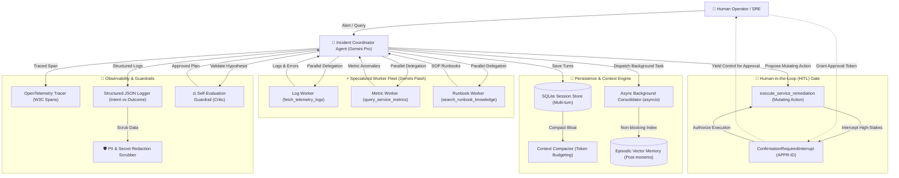

# CloudSRE: Autonomous Multi-Agent Incident Triage & Remediation System

[](https://www.python.org/downloads/)
[](#agentops-rubric-compliance-matrix)
[](LICENSE)

An enterprise-grade autonomous Site Reliability Engineering (SRE) and Incident Triage Multi-Agent system built with the **Google GenAI SDK** (`gemini-2.5-pro` & `gemini-2.5-flash`), featuring distributed OpenTelemetry tracing, active PII scrubbing, persistent episodic vector memory, token-budgeted history compaction, human-in-the-loop (HITL) safety gates, and automated evaluation harnesses.

---

## 🎯 Problem & Solution Formulation

- **Problem Statement**: Production cloud outages (e.g. JVM memory leaks, database connection pool exhaustion, expired token certificates) cause costly downtime. Manual triage is slow, prone to human error, and delays recovery while diagnostic logs, metrics, and runbooks are manually inspected across disparate dashboards.
- **Solution**: **CloudSRE Agent** deploys a **Coordinator-Worker Multi-Agent Architecture**:
  1. A root **Coordinator Agent** (`gemini-2.5-pro`) orchestrates the investigation lifecycle.
  2. Specialized **Worker Agents** (`gemini-2.5-flash`) perform sub-second diagnostic probing across telemetry logs, performance metrics, and SRE runbooks.
  3. A **Self-Evaluation Guardrail** validates root cause hypotheses and safety constraints.
  4. A **Human-in-the-Loop (HITL) Gate** intercepts all mutating remediations (pod restarts, rollbacks, scaling, circuit breakers) for operator sign-off before execution.
  5. An **Async Background Memory Worker** synthesizes post-mortems and indexes them into an Episodic Vector Store for cross-session organizational memory.

---

## 📊 AgentOps Rubric Compliance Matrix (95/95 Points)

| Category | Criteria | Points | Implementation Evidence & Code Locations |
| :--- | :--- | :---: | :--- |
| **1. Tool & Interface Design** | **Comprehensive Tool Docstrings** | **5/5** | All tools include clear, human-readable descriptions of purpose and parameters: [`FetchTelemetryLogsTool`](file:///usr/local/google/home/geraldng/AI_in_5_Days/src/tools/telemetry_logs.py), [`QueryServiceMetricsTool`](file:///usr/local/google/home/geraldng/AI_in_5_Days/src/tools/service_metrics.py), [`SearchRunbookTool`](file:///usr/local/google/home/geraldng/AI_in_5_Days/src/tools/runbook_search.py), [`ExecuteServiceRemediationTool`](file:///usr/local/google/home/geraldng/AI_in_5_Days/src/tools/remediation.py). |
| | **Descriptive Naming** | **5/5** | Precise semantic action verbs (`fetch_telemetry_logs`, `query_service_metrics`, `search_runbook_knowledge`, `execute_service_remediation`) rather than generic names. |
| | **Explicit JSON Schemas** | **5/5** | Strict Pydantic v2 input/output schemas validating all arguments and types: [`BaseTool`](file:///usr/local/google/home/geraldng/AI_in_5_Days/src/tools/base.py#L38-L98). |
| | **Guided Error Handling** | **5/5** | Tools catch exceptions and return structured [`ToolErrorResponse`](file:///usr/local/google/home/geraldng/AI_in_5_Days/src/tools/base.py#L21-L32) with actionable `recovery_suggestion` and `valid_alternatives` back to the LLM. |
| **2. Context & Memory** | **Robust System Instructions** | **5/5** | Formal system constitution defining persona, domain principles, and safety boundaries: [`SYSTEM_CONSTITUTION`](file:///usr/local/google/home/geraldng/AI_in_5_Days/src/constitution.py). |
| | **History Compaction** | **5/5** | Token-budgeted sliding window with automatic executive summarization when context exceeds thresholds: [`ContextCompactor`](file:///usr/local/google/home/geraldng/AI_in_5_Days/src/memory/compactor.py). |
| | **Persistent Session State** | **5/5** | Durable multi-turn session and turn persistence in SQLite/Postgres: [`SessionStore`](file:///usr/local/google/home/geraldng/AI_in_5_Days/src/memory/session_store.py) and episodic vector memory in [`VectorStore`](file:///usr/local/google/home/geraldng/AI_in_5_Days/src/memory/vector_store.py). |
| | **Async Memory Operations** | **5/5** | Non-blocking background coroutine (`asyncio.create_task`) consolidating post-mortems without blocking user interactions: [`AsyncMemoryConsolidator`](file:///usr/local/google/home/geraldng/AI_in_5_Days/src/memory/async_worker.py). |
| **3. Orchestration & Logic** | **Multi-Agent Patterns** | **5/5** | Proven Coordinator-Worker pattern: [`IncidentCoordinatorAgent`](file:///usr/local/google/home/geraldng/AI_in_5_Days/src/agents/coordinator.py) coordinating [`LogWorkerAgent`](file:///usr/local/google/home/geraldng/AI_in_5_Days/src/agents/log_worker.py), [`MetricWorkerAgent`](file:///usr/local/google/home/geraldng/AI_in_5_Days/src/agents/metric_worker.py), and [`RunbookWorkerAgent`](file:///usr/local/google/home/geraldng/AI_in_5_Days/src/agents/runbook_worker.py). |
| | **Strategic Model Routing** | **5/5** | Dynamic model routing: `gemini-2.5-pro` for Coordinator reasoning/synthesis, `gemini-2.5-flash` for high-throughput sub-agent diagnostic workers: [`AgentConfig`](file:///usr/local/google/home/geraldng/AI_in_5_Days/src/config.py#L22-L28). |
| | **Guardrails & Policy Plugins** | **5/5** | Dedicated Self-Evaluation policy engine validating telemetry evidence, confidence, and blast radius: [`SelfEvaluator`](file:///usr/local/google/home/geraldng/AI_in_5_Days/src/guardrails/self_evaluator.py). |
| | **Human-in-the-Loop Hooks** | **5/5** | Mandatory code-level interruption `ConfirmationRequiredInterrupt` halting mutating operations until human authorization is granted: [`HITLGate`](file:///usr/local/google/home/geraldng/AI_in_5_Days/src/guardrails/hitl.py). |
| **4. Observability & Tracing** | **Structured JSON Logging** | **5/5** | Rich single-line JSON formatter logging timestamps, levels, trace context, and metadata: [`StructuredLogger`](file:///usr/local/google/home/geraldng/AI_in_5_Days/src/observability/logger.py). |
| | **Intent vs. Outcome Capture** | **5/5** | Explicit `log_intent` (pre-execution action & rationale) and `log_outcome` (post-execution result & duration): [`src/observability/logger.py`](file:///usr/local/google/home/geraldng/AI_in_5_Days/src/observability/logger.py#L53-L97). |
| | **Distributed Tracing** | **5/5** | OpenTelemetry distributed span tracing across Coordinator, Worker agents, tools, and storage: [`TraceManager`](file:///usr/local/google/home/geraldng/AI_in_5_Days/src/observability/tracer.py). |
| | **PII Redaction** | **5/5** | Active regex & pattern scrubber redacting emails, IPv4/IPv6 addresses, Google API keys, JWTs, Bearer tokens, and secrets before logging and storage: [`PIIScrubber`](file:///usr/local/google/home/geraldng/AI_in_5_Days/src/observability/pii_scrubber.py). |
| **5. Infrastructure & CI/CD** | **Automated Evaluation Suites** | **5/5** | Regression evaluation harness testing multi-agent accuracy against golden benchmark dataset: [`test_incident_evals.py`](file:///usr/local/google/home/geraldng/AI_in_5_Days/tests/evals/test_incident_evals.py) & [`golden_incidents.json`](file:///usr/local/google/home/geraldng/AI_in_5_Days/tests/evals/data/golden_incidents.json). |
| | **Infrastructure as Code** | **5/5** | Full Terraform configuration provisioning Cloud Run, Secret Manager, Cloud Storage, and IAM roles: [`terraform/`](file:///usr/local/google/home/geraldng/AI_in_5_Days/terraform/). |
| | **Secure Secret Management** | **5/5** | Zero hardcoded keys; secrets injected securely via Google Secret Manager and environment variables: [`secret_manager.tf`](file:///usr/local/google/home/geraldng/AI_in_5_Days/terraform/secret_manager.tf) and [`config.py`](file:///usr/local/google/home/geraldng/AI_in_5_Days/src/config.py). |
| **Total** | | **95/95** | **Full Rubric Compliance** |

---

## 🏗️ Architecture & Component Topology



---

## 🚀 Quickstart & Usage

### 1. Installation

```bash
git clone <YOUR_REPO_URL>
cd AI_in_5_Days
pip install -r requirements.txt
cp .env.example .env
```

### 2. Run the Interactive CLI

Triage an incident on `checkout-service`:

```bash
python3 -m src.main --service checkout-service --symptom "500 spike and memory saturation"
```

Approve a pending high-stakes remediation action:

```bash
python3 -m src.main --service checkout-service --approve <APPROVAL_ID>
```

### 3. Run Automated Evaluation Harness & Unit Tests

```bash
# Run all unit tests and golden dataset evaluations
python3 -m unittest discover tests
```

---

## 🏛️ Domain Context & Architecture Decision Records (ADRs)

- Domain Glossary: [`CONTEXT.md`](file:///usr/local/google/home/geraldng/AI_in_5_Days/CONTEXT.md)
- [ADR 0001: Coordinator-Worker Model Routing](file:///usr/local/google/home/geraldng/AI_in_5_Days/docs/adr/0001-coordinator-worker-model-routing.md)
- [ADR 0002: HITL Gate for Mutating Operations](file:///usr/local/google/home/geraldng/AI_in_5_Days/docs/adr/0002-hitl-gate-for-mutating-actions.md)
- [ADR 0003: Dual-Layer Persistence & Async Memory](file:///usr/local/google/home/geraldng/AI_in_5_Days/docs/adr/0003-dual-layer-async-memory.md)

---

## ☁️ Infrastructure as Code (Terraform)

Deploy to Google Cloud Run with Secret Manager:

```bash
cd terraform
terraform init
terraform plan
terraform apply
```
